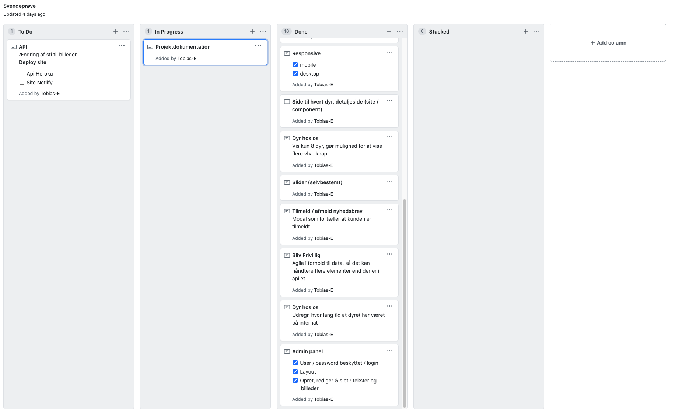

# Projektdokumentation

#### Navn: Tobias Eskou WUHF02

##### Hold: WUHF02

##### Uddannelse: Webudvikler

##### Uddannelsessted: Roskilde tekniske skole

[Link til site (localhost:3000)](http://localhost:3000/)
[Link til admin login (localhost:2000/login)](http://localhost:2000/login)
Brugernavn: admin
password: 1234

## Teknologier

-   HTML
-   CSS
-   JavaScript
-   React

---

### Vurdering af egen indsats & gennemførelse af opgaveforløbet (Arbejdsgangen)

Jeg startede med at planlægge arbejdsgangen vha. et KanBan board, som jeg oprettede på github. Delte sitet op i komponenter, som skulle laves, samt funktioner hertil. I starten fokuserede jeg på udseendet af komponenterne, da alle stod klar, tilføjede jeg funktionaliteten hertil.
Dette var hoved tilgangen til opgaven, hvilket også gjorde at sitet stod klar allerede et par dage efter opstart, dog uden funktionalitet.
Hvilket gav mig et godt udgangspunkt for at færdiggøre sitet og har virket yderst tilfredsstillende.

---

### Argumentation for de valg du selvstændigt har truffet under løsningen af opgaven

##### slider

> Jeg valgte at tilføje den obligatoriske slider, efter "om" sektionen og før "Bliv frivillig" sektionen. Da man hurtigt får et lille indblik af hvilke dyr som er på internatet. Hvilket hurtigt vil vække den besøgendenes empati, i håb om de adoptere et.
> Ydermere passer slideren bedst ind her, da der er full width billeder flere andre steder på sitet, hvilket ville gøre slideren til et forstyrrende element i forhold til dem.
> Samtidig er det også med til at dele "om" og "bliv frivillig" sektionerne op.

##### Mobil navigation

> Til den mobile navigation, valgte jeg at lave en burger menu. Jeg er normalt mest tilhænger af at have menupunkterne i bunden af skærmen, når det kommer til mobile navigationer, da de er lettere at nå, men da menupunkternes overskrifter ikke bare var et enkelt ord, hvilket gjorde dem lange. Valgte jeg at gå med burger menu, for skabe det fornødne overblik til at navigere rundt.

##### Vis flere dyr

> Løsningen af indlæsningen af flere dyr, blev en knap som viser flere dyr end de 8 som skulle vises fra start.
> Grunden her for er at det designmæssigt og performance passede bedst ind i det udleverede design.

##### Admin panel

> Blev opbygget på den simple måde, at der blive lavet udtræk for alle de elementer som skal kunne ændres, samt en tilføj knap til hver sektion.
> Dette gør det muligt, at kunne trykke på den ønskede element, som skal ændres, hvor efter der kommer et modal op, med de nuværende informationer, som herefter så står en frit for om skal ændres.
> Ydermere er der mulighed for at slette det valgte element.
> Efter alle elementerne i hver sektion, findes et tilføj element, med de fornødne input felter.

---

### Redegørelse for oprindelsen af evt. tredjeparts kode anvendt i opgaveløsningen (Teknisk dokumentation)

##### Recoil

> Hjælper til at styre states, hvilket gør det muligt at sende dem på kryds og tværs af komponenter, uden alle problemerne med propdrilling.
> Her kan de forskellige states tilgås præcis det ønskede element.

##### Flickity

> Har jeg anvendt til at lave den ønskede slider, da alt funktionaliteten følger med her og det kun er minimal styling som skal til for at opnå det ønskede resultat.

##### Styled-components

> Anvendes til at style de ønskede komponenter med. Det er for at undgå at opdele styling og funktionalitet, så alt hvad som hører til et komponent er samlet i samme dokument.
> Det gør det også lettere at håndtere forskellig styling i forhold et state.

##### React-router-dom

> Anvender jeg til, at vise det enkeltes dyr detaljeside, så det ikke var nødvendigt at lave en side til hvert dyr, men derimod et template, hvor der bliver sat nogle informationer ind, i stedet.
> Samt det er blevet anvendt til login styring i admin panelet.

##### React-modal

> Har jeg brugt til at komme op med kvitteringen for tilmeldelse af nyhedsbrevet. Ydermere har jeg anvendt det til admin panelet, til når der skal laves ændringer.

##### React-hook-form

> Er anvendt til at håndtere forms og deres request, f.eks. til nyhedsbrevet men også til ændringer og tilføjelser i admin panelet.

### En beskrivelse af særlige punkter til bedømmelse

`calcDate` funktionen har jeg lavet for at kunne udregne hvor lang tid, det enkelte dyr har været på internatet.
Her opretter jeg 2 variabler, `today` som kalder `new Date` og finder ud af tidspunktet nu, og `arrived` som tager imod et argument, for hvornår at dyret er blevet anbragt på internatet.
Dette trækker jeg fra hinanden i variablen `difference`, hvor efter at jeg forkorter det ind til hele dage i variablen `differenceInDays`. Hvilket jeg så returnerer, som så kan indsættes hvor jeg skal bruge det.

```js
function calcDate(e) {
	let today = new Date();
	let arrived = new Date(e);
	let difference = today - arrived;
	let differenceInDays = Math.floor(difference / (1000 * 3600 * 24));
	return differenceInDays;
}
```

`useState` anvender jeg til at kontrollere hvor mange dyr som bliver vist på sitet.
`useState` fungerer på den måde at man definere en variabel og en function i arrayet. Som så bliver deklareret vha. useState, hvor man i paratesen definerer hvad variabelen skal være fra start af.
Så hvis man laver en `console.log(count)` vil 8 blive udskrevet.
Hvis jeg så kalder `setCount(count + 2)` og laver en `console.log(count)` vil 10 blive udskrevet.
Dette er enorm nyttigt til f.eks. at tjekke op en menu er åben eller lukket vha. `true/false` state.

```jsx
const [count, setCount] = useState(8);
```

---

#### Kanban bilag


